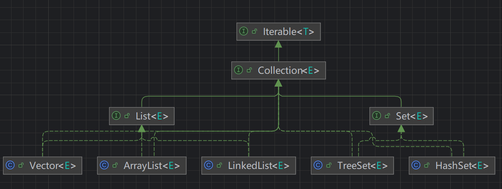
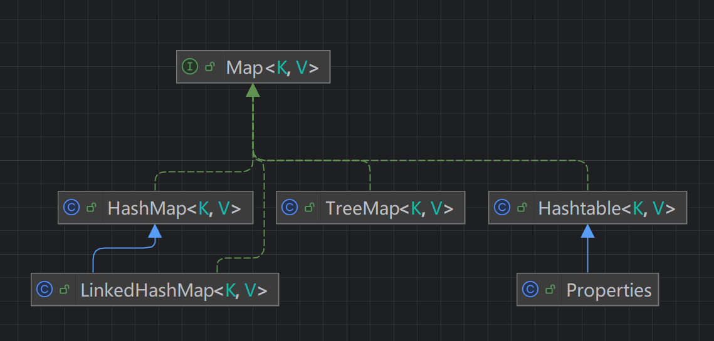

# JavaSE常用语法和库

## JavaSE常用语法

### 枚举(enumeration，缩写enum)

#### 适用场景

1.值是有限的几个值；2.只读，不需要修改。

#### 两种实现方式：

##### 1.自定义类实现

```java
class Season {//类
	private String name;
	private String desc;//描述
	//定义了四个对象, 固定.
	public static final Season SPRING = new Season("春天", "温暖");
	public static final Season WINTER = new Season("冬天", "寒冷");
	public static final Season AUTUMN = new Season("秋天", "凉爽");
	public static final Season SUMMER = new Season("夏天", "炎热");
    private Season(String name, String desc) {
    this.name = name;
    this.desc = desc;
}
public String getName() {
    return name;
}
public String getDesc() {
    return desc;
}
@Override
public String toString() {
    return "Season{" +
            "name='" + name + '\'' +
            ", desc='" + desc + '\'' +
            '}';
    }
}
```

特点如下：

1) 构造器私有化
2) 本类内部创建一组对象[四个春夏秋冬]
3) 对外暴露对象（通过为对象添加public final static 修饰符）
4) 可以提供get 方法，但是不要提供set

##### 2.enum关键字实现

```java
enum Season {
    //如果使用了enum 来实现枚举类
    //1. 使用关键字enum 替代class
    //2. public static final Season SPRING = new Season("春天", "温暖") 直接使用
    // SPRING("春天", "温暖") 解读常量名(实参列表)
    //3. 如果有多个常量(对象)， 使用,号间隔即可
    //4. 如果使用enum 来实现枚举，要求将定义常量对象，写在前面
    //5. 如果我们使用的是无参构造器，创建常量对象，则可以省略()
    SPRING("春天", "温暖"), WINTER("冬天", "寒冷"), AUTUMN("秋天", "凉爽"),
    SUMMER("夏天", "炎热")/*, What()*/;
    private String name;
    private String desc;//描述
    private Season2() {//无参构造器
    }
    private Season2(String name, String desc) {
        this.name = name;
        this.desc = desc;
	}
    public String getName() {
        return name;
    }
    public String getDesc() {
        return desc;
    }
    @Override
    public String toString() {
        return "Season{" +
                "name='" + name + '\'' +
                ", desc='" + desc + '\'' +
                '}';
    }
}
//调用代码如下：
Season season1 = Season.Spring;
System.out.println(season1);	//会输出Spring，本质是调用父类Enum的toString
```

注意事项如下：

1. 当我们使用enum 关键字开发一个枚举类时，默认会继承Enum 类, 而且是一个final 类[如何证明],老师使用javap 工具来演示
2. 传统的public static final Season2 SPRING = new Season2("春天", "温暖"); 简化成SPRING("春天", "温暖")， 这里必
   须知道，它调用的是哪个构造器.
3. 如果使用无参构造器创建枚举对象，则实参列表和小括号都可以省略
4. 当有多个枚举对象时，使用,间隔，最后有一个分号结尾
5. 枚举对象必须放在枚举类的行首.

**具体内容查看笔记第十一章枚举部分**

## JavaSE常用库

### 集合与数组

常用库中最多的是集合，集合概念是针对数组的不便之处提出的。

数组的缺陷：

1. 长度开始时必须指定，并且指定后不能更改
2. 保存的必须是同一类型的元素
3. 使用数组进行增加/删除元素的代码比较繁琐

集合的特点：

1. 可以**动态保存**任意多个对象
2. 提供了一系列便于操作对象的方法：add、remove、set、get等
3. 使用集合添加/删除元素的代码较简洁

### 集合的分类

java中的集合类很多，主要分为两大类：

#### Collection



##### 常用方法：

1. add：添加单个元素
2. remove：删除指定元素
3. contains：查找元素是否存在
4. size：获取元素个数
5. isEmpty：判断是否为空
6. clear：清空
7. addAll：添加多个元素
8. containsAll：查找多个元素是否都存在
9. removeAll：删除多个元素

##### List：

常用接口，添加了一些根据索引来操作集合元素的方法

1. void add(int index, Object ele)：在index位置插入ele元素
2. boolean addAll(int index, Collection eles)：从index位置开始将eles中的所有元素添加进来
3. Object get(int index)：获取指定index位置的元素
4. Int indexOf(Object obj)：返回obj在集合中首次出现的位置
5. int lastIndexOf(Object obj)：返回obj在当前集合中末次出现的位置
6. Object remove(int index)：移除指定index位置的元素，并返回此元素
7. Object set(int index, Object ele)：设置指定index位置的元素为ele，相当于是替换
8. List subList(int fromIndex, int toIndex)：返回从fromIndex到toIndex未知的子集合

##### List的三种遍历方式（ArrayList，LinkedList，Vector）：

1. 使用iterator

   ```java
   // List list = new ArrayList();
   // List list = new Vector();
   List list = new LinkedList();
   
   Iterator iterator = list.iterator();
   while (iterator.hasNext()) {
     Object obj = iterator.next();
     System.out.println(obj);
   }
   ```

2. 使用增强for

   ```java
   for (Object o : list) {
     System.out.println("o = " o);
   }
   ```

3. 使用普通for

   ```java
   for (int i = 0; i < list.size(); i++) {
     System.out.println(list.get(i));
   }
   ```

##### ArrayList，LinkedList，Vector底层特点和使用分析：

**ArrayList**

底层特点：

1. 底层维护了Object类型的数组elementData
2. 创建ArrayList时使用无参构造器，初始容量是0，首次添加元素扩容至10，如果需要再次扩容，增大到1.5倍
3. 使用指定大小的构造器，初始容量为指定大小，再次扩容增大到1.5倍

**Vector**

底层特点：

1. 底层维护数组对象，protected Object[] elementData
2. Vector是线程同步的，即线程安全，操作方法带synchronized，相对而言，ArrayList不是线程安全的

**LinkedList**

底层特点：

1. 底层维护了一个双向链表，实现了双向链表和双端队列的特点
2. 维护了两个属性first和last分别指向首节点和尾节点
3. 每个节点（Node对象），里面维护了prev、next、item三个属性
4. 元素添加和删除不是通过数组完成的，相对来说效率较高

##### Set：

特点：

1. 无序（添加和取出的顺序不一致），没有索引

2. 不允许重复元素，所以最多包含一个null

3. JDK API中Set接口的实现类有：

   所有超级接口：Collection<E>，Iterable<E>

   所有已知子接口：NavigableSet<E>，SortedSet<E>

   所有已知实现类：AbstractSet，ConcurrentSkipLIstSet，CopyOnWriteArraySet，EnumSet，**HashSet**，JobStateReasons，LinkedHashSet,**TreeSet**

##### Set的两种遍历方式：

set接口对象，**不能通过索引**来获取，所以没有普通for遍历方式

1. 使用迭代器

   ```java
   // Set set = new TreeSet();
   Set set = new HashSet();
   
   Iterator iterator = set.iterator();
   while (iterator.hasNext()) {
     Object obj = iterator.next();
     System.out.println("obj = " obj);
   }
   ```

2. 使用增强for

   ```java
   for (Object o : set) {
     System.out.println("o = " + o);
   }
   ```

##### **HashSet**

底层机制：

1. 实现了Set接口
2. 实际上是HashMap，HashMap底层是数组+链表+红黑树
3. 可以存放null，但只能有一个null
4. 不保证元素是有序的（指的是存入顺序和取出顺序不一定一致，但是取出的顺序是固定的），取决于hash后，确定索引的结果
5. 不能有重复元素

HashSet如何判断底层元素是否重复：利用hash()+equals()

1. 添加元素时显得到hash值，转变为索引值
2. 找到存储数据表table，如果索引值位置为空，直接加入
3. 如果索引值位置被占用，调用equals比较，如果相同放弃添加，如果不同，添加到最后
4. 如果一条链表的个数达到TREEIFY_THRESHOLD，（默认是8），并且table大小>=MIN_TREEIFY_CAPACITY（默认64），就会把链表进行树化

HashSet扩容和树化机制：

1. 底层是HashMap，第一次添加table数组扩容到16，临界值（threshold）是16 * 加载因子（loadFactor，0.75） = 12
2. 如果达到临界值，直接扩容到两倍32，新的临界值就是32 * 0.75 = 24
3. java8中，一条链表的个数达到TREEIFY_THRESHOLD，（默认是8），并且table大小>=MIN_TREEIFY_CAPACITY（默认64），会进行树化（红黑树），否则仍然采用数组扩容机制

##### LinkedHashSet

**基本介绍：**

1. LinkedHashSet是HashSet的子类
2. LinkedHashSet底层是一个LInkedHashMap，底层维护了一个数组+双向链表
3. 根据元素的hashCode确定元素的存储位置，使用链表维护元素的次序，保证输出顺序和输入顺序一致，但在存储上并不是这样
4. 不允许添加重复元素

**底层机制：**

1. LinkedHashSet中维护了一个hash表和双向链表（LinkedHashSet有head和tail）
2. 每个节点有before和after属性，可以形成双向链表
3. 添加一个元素，先求hash值，再求索引值，确定该元素在table的位置，然后将元素加入双向链表

#### Map



**接口特点：**

1. Map和Collection并列存在，用于保存具有映射关系的数据：Key-Value
2. Map中的key和value可以是任何引用类型的数据，会封装到HashMap$Node对象中
3. Map中的key不允许重复，原因和HsahSet一致（HashSet底层就是HashMap，HashMap实现了Map接口，所以也不允许重复）
4. Map中的value可以重复
5. Map的key可以为null，只能有一个，value也可也为null，可以有多个
6. 常用String类作为Map的key
7. key和value之间存在单向一对一的关系

**常用方法：**

1. put()：放入一个键值对，key在前，value在后
2. remove()：根据key删除映射关系
3. get()：根据key获得对应的value
4. size()：获取元素个数
5. isEmpty()：判断个数是否为0
6. clear()：清楚所有键值对
7. containsKey()：查找key是否存在

**遍历方法：**

1. containsKey：查找键是否存在
2. keySet：获取所有的键
3. entrySet：获取所有关系k-v
4. values：获取所有的值

一、先取出所有的Key，通过Key取出对应的Value

1. 增强for

   ```java
   Map map = new HashMap();
   Set keyset = map.keySet();
   for (Object key : keyset) {
     System.out.println(key + "-" + map.get(key));
   }
   ```

2. 迭代器

   ```java
   Iterator iterator = keyset.iterator();
   while (iterator.hasNext()) {
     Object key = iterator.next();
     System.out.println(key + "-" + map.get(key));
   }
   ```

二、把所有的values取出

1. 增强for

   ```java
   Map map = new HashMap();
   Collection values = map.values();
   for (Object value : values) {
     System.out.println(value);
   }
   ```

2. 迭代器

   ```java
   Iterator iterator = values.iterator();
   while (iterator.hasNext()) {
     Object value = iterator.next();
     System.out.println(value);
   }
   ```

三、通过EntrySet来获取k-v

1. 增强for

   ```java
   Map map = new HashMap();
   Set entrySet = map.entrySet(); // EntrySet<Map.Entry<K, V>>
   for (object entry : entrySet) {
     // entry转成Map.Entry
     Map.Entry m = (Map.Entry)entry;
     System.out.println(m.getKey()) + "-" + m.getValue());
   }
   ```

2. 迭代器

   ```java
   Iterator iterator = entrySet.iterator();
   while (iterator.hasNext()) {
     Object entry = iterator.next();
     Map.Entry m = (Map.Entry) entry;
     System.out.println(m.getKey() + "-" + m.getValue());
   }
   ```

##### HashMap

1. Map接口的常用实现类：HashMap、Hashtable和Properties
2. HashMap时Map接口使用频率最高的实现类
3. key不能重复，value可以重复，可以使用null作为key和value
4. 添加相同的key，会覆盖原来的k-v，等同于修改，key不会替换，val会替换
5. 和HashSet一样，不保证输出的顺序和输入顺序一致，因为底层是以hash表的方式来存储
6. 没有实现线程同步，是线程不安全的

底层机制：扩容机制与HashSet一致，因为HashSet底层就是HashMap

##### HashTable

1. 存放键值对k-v
2. HashTable的key和value都不能是null，会抛出NullPointerException
3. HashTable使用方法基本和HashMap一样
4. HashTable是线程安全的，HashMap不是线程安全的

##### ProPerties

1. Properties类继承自HashTable类，并且实现了Map接口，使用k-v保存数据
2. 使用特点HashTable类似
3. Properties还可以用于从.propertires文件中，加载数据到Properties类对象，进行读取和修改

#### 开发中如何选择集合实现类

1. 判断存储的类型：一组对象（单列）或一组键值对（双列）

2. 一组对象（单列）：Collection

   允许重复：List

   ​	增删多：LinkedLIst（底层维护了一个双向链表）

   ​	改查多：ArrayList（底层维护了Object类型的可变数组）

   不允许重复：Set

   ​	无序：HashSet（底层是HashMap，维护了一个哈希表，即：数组+链表+红黑树）

   ​	排序：TreeSet，默认构造器创建TreeMap是无序的，但是传入Comparator可以按照规则对元素排序

   ​	插入和取出顺序一致：LinkedHashSet，维护数组+双向链表

3. 一组键值对（双列）：Map

   ​	键无序：HashMap（底层是：哈希表，jdk：数组+链表，jdk8:数组+链表+红黑树）

   ​	键排序：TreeMap，与TreeSet一致，默认无序，传入Comparator排序

   ​	键插入和取出顺一致：LinkedHashMap

   ​	读取文件：Properties

### Collections工具类

1. Collections是一个操作Set、List和Map等集合的工具类
2. Collections中提供了一系列静态的方法对集合元素进行排序、查询和修改等操作

#### 排序操作

1. reverse(List)：反转List中元素的顺序
2. shuffle(List)：对List集合元素进行随机排序
3. sort(List)：根据元素的自然顺序对指定List集合元素按升序排序
4. sort(List, Compatartor)：根据指定的Comparator产生的顺序对List集合元素进行排序
5. swap(List, int, int)：将指定list集合中的 i 处元素和 j 处元素进行交换

#### 查找、替换

1. Object max(Collection)：根据元素的自然顺序，返回给定集合中最大的元素
2. Object max(Collection, Comparator)：根据Comparator指定的顺序，返回给定集合中的最大元素
3. Object min(Collection)
4. Object min(Collection, Comparator)
5. int frequency(Collection, Object)：返回指定集合中指定元素的出现次数
6. void copy(List dest, List src)：将src中的内容复制到dest中
7. boolean replaceAll(List list, Object oldval, Object newVal)：使用新值替换List对象的所有旧值


